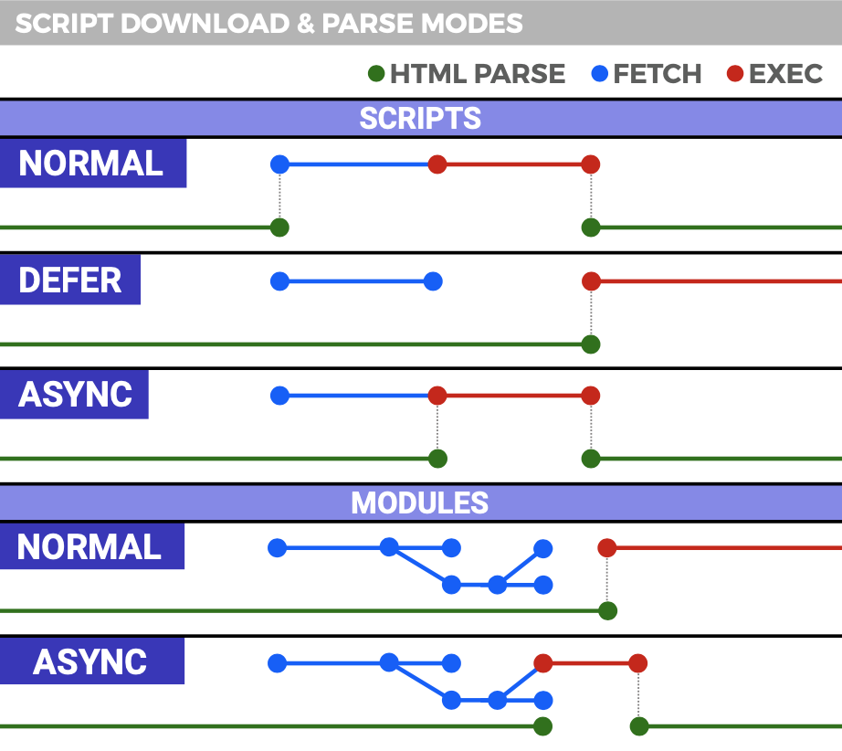
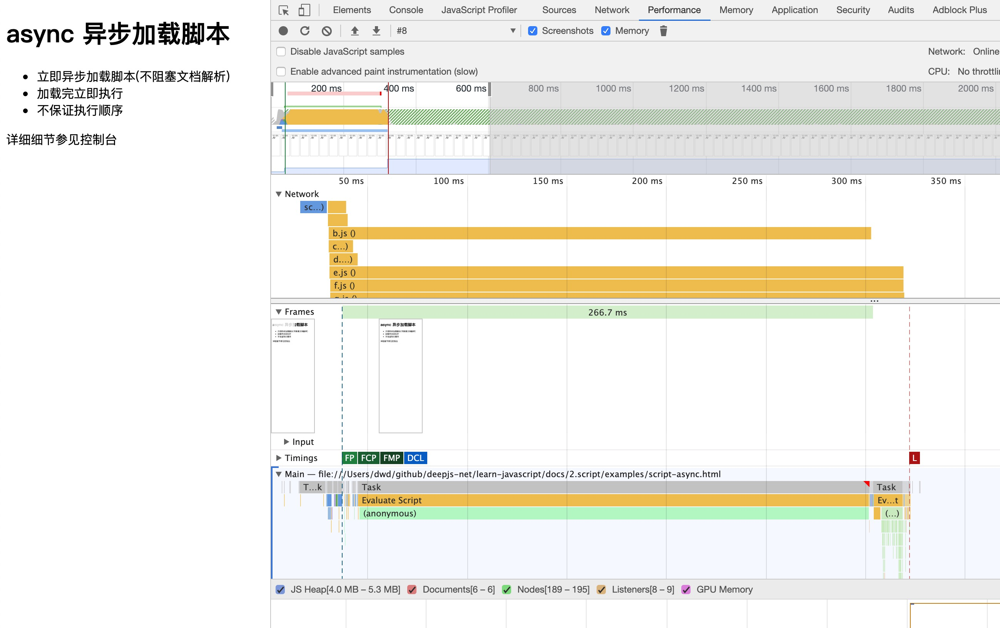
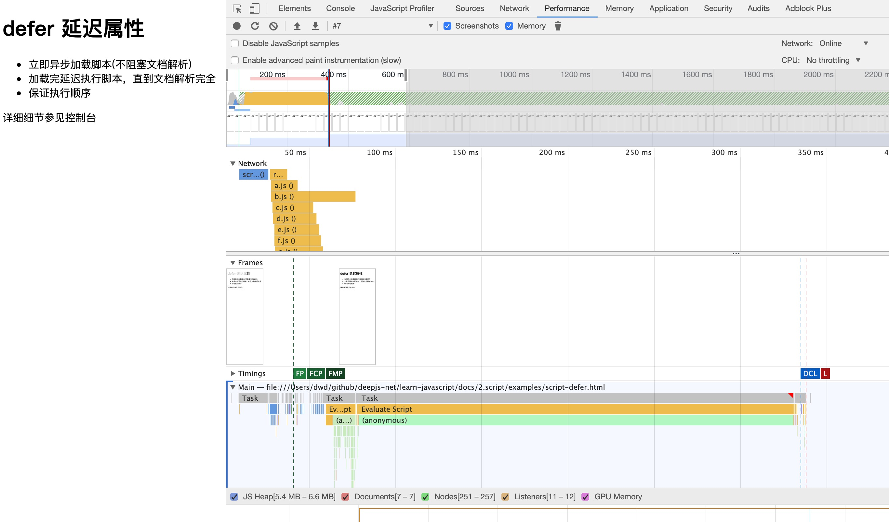

# 引入 js

添加到脚本标签时，以下两个属性可以解除对解析器的阻塞

- `async` 确保脚本在后台下载并在下载完成后第一时间执行。
- `defer` 确保脚本在后台下载并在解析完全完成后执行。

引入使用 js 的方式有多种形式

- 行内引入，``
- 使用 script 标签，内联嵌入在当前的 `html` 文档内
- 使用 script 标签引入外部 js
- 也可以动态加载
- 浏览器对于带有`type="module"`的`<script>`
  - 默认(无 async)都是异步加载，不会造成堵塞浏览器（解析 html），会等到整个页面渲染完，再执行模块脚本，等同于打开了`<script>`标签的`defer`属性
  - 但如果加了 async 属性，也是异步加载，不会造成堵塞浏览器，但会加载完成立即执行，此时会阻塞渲染。

重点内容便是掌握 **js 的加载时序与执行时序**

> `document.currentScript` 可以获得当前正在运行的脚本(Chrome 29+, FF4+)

**如果是内联嵌入**

则按文档流**顺序加载**，并**总是立即执行(依次)**，此时**会阻塞文档解析**，此时 `async` 属性无效。

详见示例[script-inline](./examples/script-inline.html)

**如果是加载外部 js，则分以下几种情况：**

1. 默认情况下，没有 `defer` 或 `async` 属性

   ```html
   <script src="script.js"></script>
   ```

   script 标签默认行为（不带 defer 或 async 属性）会阻止文档解析，相关脚本会**立即加载并执行**。脚本执行顺序和 script 标签出现的顺序一致。测试示例[script](./examples/script.html)

   “立即”指的是在渲染该 script 标签时，就立即加载并执行脚本，此时终端该标签之下的文档解析，直到脚本加载并执行完成，再继续后面的文档解析。

2. 带有 `async` 属性

   `async` 属性是 html5 新特性(IE10+)。

   ```html
   <script async src="script.js"></script>
   ```

   `async` 表示异步加载 js(不阻塞文档解析)，并且异步执行。脚本执行顺序是**乱序**的。测试示例[script-async](./examples/script-async.html)

   加载和渲染后续文档元素的过程将和 `script.js` 的加载与执行并行进行（异步）。

   NOTE: 通过脚本异步插入的 script 标签达到的效果和带`async`属性的 script 标签是一样的

3. 带有 `defer` 属性

   ```html
   <script defer src="script.js"></script>
   ```

   `defer` 表示会推迟脚本的执行，并且不阻塞文档解析，其执行如同脚本放在 `</body>` 之前。如果脚本放在`<head>`中，会更早的下载，且不用担心被其他脚本推迟下载事件。

   加载解析后续文档元素的过程将和 `script.js` 的加载并行进行（异步），但是 `script.js` 的执行要在所有元素解析完成之后，并且在 `DOMContentLoaded` 事件触发之前完成（会延迟此事件的触发）。测试示例[script-defer](./examples/script-defer.html)

   同时，带有`defer`的脚本彼此之间，能保证其执行顺序。

   **注意：**`DOMContentLoaded` 事件必须等待其所属 script 之前的样式表加载解析完成才会触发。

   而 `window` 对象上的 `onload` 事件在所有文件包括样式表，图片等其他资源全部下载完毕后才触发。

4. 同时带有 `async`, `defer` 属性

   ```html
   <script async defer src="myscript.js"></script>
   ```

   效果同 `async`。测试示例[script-async-and-defer](./examples/script-async-and-defer.html)

概括来讲，就是这两个属性都会使 script 标签异步加载，然而执行的时机是不一样的。如下图



蓝色线代表网络读取，红色线代表执行时间，这俩都是针对脚本的；绿色线代表 HTML 解析。

此图告诉我们以下几个要点：

- `defer` 和 `async` 在网络读取（下载）这块儿是一样的，都是异步的（相较于 HTML 解析）
- 它俩的差别在于脚本下载完之后何时执行，显然 `defer` 是最接近我们对于应用脚本加载和执行的要求的
- 关于 `defer`，此图未尽之处在于它是按照加载顺序执行脚本的，这一点要善加利用
- `async` 则是一个乱序执行的主，反正对它来说脚本的加载和执行是紧紧挨着的，所以不管你声明的顺序如何，只要它加载完了就会立刻执行
- 仔细想想，`async` 对于应用脚本的用处不大，因为它完全不考虑依赖（哪怕是最低级的顺序执行），不过它对于那些可以不依赖任何脚本或不被任何脚本依赖的脚本来说却是非常合适的，最典型的例子：Google Analytics

理解了，就方便记忆、使用了。

> 动态创建 script 标签的形式加载的脚本，它的 async 属性是 true，如果想按顺序执行，可以将其设置为 false

## 性能分析




**小扩展**

尝试做性能分析：为什么一再强调将 css 放在头部，将 js 文件放在尾部？

假如我们将 js 放在 header，js 将阻塞解析 dom，dom 的内容会影响到 First Paint，导致 First Paint 延后。所以说我们会将 js 放在后面，以减少 First Paint 的时间，但是不会减少 DOMContentLoaded 被触发的时间。

## 关于 `document.write`

将一个文本字符串写入一个由 `document.open()` 打开的文档流

因为 `document.write` 需要向文档流中写入内容，所以，若在一个已关闭（例如，已完成加载）的文档上调用 `document.write`，就会自动调用 `document.open`，**这将清空该文档的内容**。

```html
<script>
  document.write(`<script src="js/f.js"><\/script>`);
</script>
```

详细过程：

[example](./examples/document-write.html)

- 如果页面在 loading 状态，则按照自上而下的顺序依次解析 script，遇到 write 直接输出当前位置（如在 head 内则输出到 body 顶部）。
- 如果在`DOMContentLoaded`或`load`事件的回调函数中，当文档加载完成，则会先清空文档（自动调用`document.open()`），再把参数写入`body`内容的开头。有的同学说将 document.open=function(){}是不是可以避免，结论是 No。
- 如果在异步引入的 js 中运行`document.write()`，运行完后，最好手动关闭文档写入（`document.close()`）。

> **注意：**在有`deferred` 或 `asynchronous` 属性的 script 中，`document.write` 会被忽略，控制台会显示 "A call to document.write() from an asynchronously-loaded external script was ignored" 的报错信息。
>
> **注意：**在 Edge 中，在 [`<iframe>`](https://developer.mozilla.org/zh-CN/docs/Web/HTML/Element/iframe) 内部调用 `document.write` 多于一次时会引发错误 SCRIPT70: Permission denied。
>
> **注意：**从 Chrome 55 开始，Chrome（可能）不会运行通过 `document.write()` 注入的`<script>`，以防止使用 2G 连接的用户找不到 HTTP 缓存。前往[此链接](https://developers.google.cn/web/updates/2016/08/removing-document-write)查看这种情况发生需要满足的条件。
>
> 如果 js 是异步引入的（加 async 或者动态加入的），里面的 document.write 因安全原因是无法工作的。"Failed to execute 'write' on 'Document': It isn't possible to write into a document from an asynchronously-loaded external script unless it is explicitly opened."

执行顺序和普通的 script 标签没有区别。即使你插入的标签带有`async`或`defer`，其行为也是没有区别的。

其他

- 现代浏览器资源存在并行下载限(制通常为 6 个)，启用 http2 可以多路复用

## 实现动态加载 js

```js
// import {loadJs, loadCss} from '@deepjs/load';

let doc;
let domHead;

if (typeof document !== 'undefined') {
  doc = document;
  domHead = doc.querySelector('head') || doc.querySelector('body');
}

// const s = doc.getElementsByTagName('script')[0];

export function load({ tag, getDomTag, ...attributes }) {
  return new Promise((resolve, reject) => {
    if (!doc)
      return reject(
        new Error(
          `load source fail: can not execute code from non browser environment`,
        ),
      );
    if (!domHead)
      return reject(
        new Error(`load source fail: document not exist head && body tag`),
      );

    const isExists = Boolean(doc.querySelector(getDomTag()));
    if (isExists) return resolve({ code: 0, message: '资源已存在' });

    const source = doc.createElement(tag);
    Object.entries(attributes).forEach(([attribute, value]) => {
      source.setAttribute(attribute, value);
    });
    source.onload = () => {
      resolve({ code: 1, message: '资源加载成功' });
    };
    source.onerror = (error) => {
      reject(error);
    };
    // s.parentNode.insertBefore(s1, s);

    domHead.appendChild(source);
  });
}

export function loadJs(sourceUrl, obj = {}) {
  // 默认是同步加载，同步模式又称阻塞模式
  // 同步加载流程是瀑布模型，异步加载流程是并发模型。
  const options = {
    src: sourceUrl,
    // async: false, // 异步加载
    // defer: false, // 延迟加载
    // crossOrigin: 'anonymous', // 默认不要开启，因为开启后，如果服务端不配合 CORS 设置，会导致无法正常加载（特别是第三方脚本）
    ...obj,
    tag: 'script',
    getDomTag() {
      return `script[src="${sourceUrl}"]`;
    },
  };
  return load(options);
}

export function loadCss(sourceUrl, obj = {}) {
  const options = {
    href: sourceUrl,
    ...obj,
    rel: 'stylesheet',
    tag: 'link',
    getDomTag() {
      return `link[href="${sourceUrl}"]`;
    },
  };
  return load(options);
}
```

## 经典问题

- css 资源的加载，不会阻塞 DOM 树解析，但会阻塞渲染
- js 资源的加载，会阻塞 DOM 树的构建和渲染，除非设置了 script 标签的异步属性
- 放在 head 中会在解析 DOM 树和渲染页面前就加载，并阻塞页面
- js 正常情况下加载完就会立即执行，在 js 脚本中只能访问当前`<script>`以上的 DOM，脚本执行结束后再继续解析 DOM。
- js 执行引擎和页面渲染是由不同的线程来执行，但这两者是互斥的，也就是说 js 执行过程是无法构建 DOM 和渲染页面的
- html 与 js 是否并行下载？
- 是 js 的下载阻塞了页面的渲染还是 js 的执行阻塞了页面的渲染，还是两者都会阻塞页面
- script 标签放在 head 中与放在 body 中，是影响了 js 的下载开始时间还是执行开始时间
- css，图片以及一些其它的外部资源的下载是否与 html，js 的下载并行
- js，css 加载和执行过程是否会阻塞 html 解析、渲染？其他资源呢

资源（css,js,img 等）的加载都是并行的，浏览器尝试将所有外部资源下载并行化，尽快的完成，但需要考虑并发的数量。

## 提示

深入理解 script 加载与执行机制，对性能提升，加载器实现非常重要

## 资源跨域

### 关于 script crossorigin

script 标签就是可以跨域请求资源的，那 `crossorigin="anonymous"` 这个设置是为了什么？

1. script 标签默认请求资源的时候，request 是没有 origin 请求头的（这是常规理解的支持跨域请求资源）
2. script 标签请求跨域资源，内部运行如果报错，`window.onerror` 捕获错误时，只能看到 `Script error.`，无法看到具体的错误信息。这是浏览器安全策略控制的。

为了避免 `Script error.` 问题

原因

`<script>` 标签去请求资源的时候，request 是没有 origin 请求头的。此时如果脚本是跨域的，如果这个脚本有错误，使用 `window.onerror` 捕获错误时，跨域脚本的错误只会返回 `Script error.`。

HTML5 新的规定，是可以允许本地获取到跨域脚本的错误信息，但有两个条件：一是跨域脚本的服务器必须通过 `Access-Controll-Allow-Origin` 头信息允许当前域名可以获取错误信息，二是当前域名的 script 标签也必须指明 src 属性指定的地址是支持跨域的地址，也就是 `crossorigin` 属性。

解决方案

1. 服务端: `Access-Control-Allow-Origin: *`
2. 客户端: crossorigin
   1. 设置一个空的值，如 crossorigin 或 crossorigin=""，和设置 anonymous 的效果一样。

详细描述如下

1. 设置 script 标签的 crossorigin 属性，request 请求时会带上 origin 请求头，然后会要求服务器进行 cors 校验，跨域请求如果响应头没有 `Access-Control-Allow-Origin` 就不会拿到资源（加载资源报跨域错误）。cors 验证通过后，拿到的 `script` 运行内部报错的话，`window.onerror` 就能捕获到内部的完整错误信息。
2. `crossorigin` 的属性值分为 `anonymous` 和 `use-credentials`。如果设置了 `crossorigin` 属性，但是属性值不正确的话（或设置""，或没有值），默认都是 `anonymous`。
3. `anonymous` 代表同域会带上 cookie，跨域则不带上 cookie，相当于 fecth 请求的`credentials: 'same-origin'`。
4. `use-credentials` 跨域也会带上 cookie，相当于 fetch 请求的 `credentials: 'include'`，这种情况下跨域的 response header 需要设置`'Access-Control-Allow-Credentials' = true`，否则 cors 失败。

> `crossorigin=use-credentials` 可以跨域带上 cookie。当然也需要服务端配合，添加响应头设置`'Access-Control-Allow-Credentials' = true`

### 关于 `Vary: Origin`

可使用 `Vary: Origin` 让同一个 URL 有多份缓存

> If CORS protocol requirements are more complicated than setting `Access-Control-Allow-Origin` to \* or a static origin, `Vary` is to be used.
>
> 如果你的 `Access-Control-Allow-Origin` 响应头不是简单的写死成了\*或者某一个特定的源（就是我总结的条件型 CORS 响应），那么你就应该加上`Vary: Origin`响应头。

- https://fetch.spec.whatwg.org/#cors-protocol-and-http-caches
- https://zhuanlan.zhihu.com/p/38972475
- http://wscdn.huanleguang.com/assets/oss_img_cors_demo.v3.html

### CORS 请求 与 非 CORS 请求

浏览器在哪些情况下会发起 CORS 请求，哪些情况下发起非 CORS 请求，是有严格规定的。比如

- 在一般的 `` 标签下发起的就是个非 CORS 请求
- 而在 `XHR/fetch` 下默认发起的就是 CORS 请求；
- 还比如在一般的 `<script>` 标签下发起的是非 CORS 请求（所以才能有 jsonp）
- 而在新的 `<script type="module">` 下发起的是 CORS 请求

CORS 请求会带上 Origin 请求头，用来向别人的网站表明自己是谁；非 CORS 请求不带 Origin 请求头。

- 无条件型 CORS 响应
  - 将 `Access-Control-Allow-Origin` 固定写死为 `*`（允许任意网站访问）
  - 或者**固定写死特定的某一个源**（只允许这一个网站访问），不论请求头里的 Origin 是什么，甚至没有 Origin 也一样返回那个值。
- 条件型 CORS 响应
  - 区分对待有无 Origin 请求头
  - 区分对待不同的 Origin 请求头

> 如果一个源，没有允许跨域，使用 script 非 cors 请求，不会有问题，此时添加 crossorigin="anonymous" 反而会报错。
>
> 具体看请求头 `Sec-Fetch-Mode`

参考：

- 红皮书
- [是 js 的加载阻塞了页面的渲染还是 js 的执行阻塞了页面的渲染？](https://www.zhihu.com/question/61309490)
- [Script 标签和脚本执行顺序](http://pij.robinqu.me/Browser_Scripting/Document_Loading/ScriptTag.html)
- https://segmentfault.com/a/1190000000515181
- https://segmentfault.com/q/1010000000640869
- [浅谈 script 标签的 defer 和 async](https://juejin.im/entry/5a7ad55ef265da4e81238da9)
- [DOMContentLoaded 与 load 的区别](https://www.cnblogs.com/caizhenbo/p/6679478.html)
- https://developer.mozilla.org/zh-CN/docs/Web/Events/DOMContentLoaded
- [[译]页面生命周期：DOMContentLoaded, load, beforeunload, unload 解析](https://github.com/fi3ework/blog/issues/3)
- [全面理解 document.write()](https://segmentfault.com/a/1190000007958530)
- [MDN document.write](https://developer.mozilla.org/zh-CN/docs/Web/API/Document/write)
- [document.write 知多少](https://segmentfault.com/a/1190000006197157)
- [script crossorigin 属性](https://juejin.cn/post/6969825311361859598)

性能分析

使用 `<link rel="preconnect" href="https://fonts.gstatic.com/" crossorigin>` 可优化资源加载 crossorigin 属性必须，不然资源会加载两次

- https://web.dev/efficiently-load-third-party-javascript
- https://web.dev/use-lighthouse-for-performance-budgets/
- https://www.cdnplanet.com/blog/faster-google-webfonts-preconnect/
- https://web.dev/codelab-optimize-third-party-javascript/
- https://developer.akamai.com/blog/2012/12/12/non-blocking-script-loader-pattern#the_method_queue_pattern
  - 单点故障 https://calendar.perfplanet.com/2012/spof-bug/
  - https://blog.patrickmeenan.com/2011/10/testing-for-frontend-spof.html

性能测试

- https://github.com/marcelduran/webpagetest-api
- https://webpagetest.org
- https://developers.google.com/speed/pagespeed/insights/
- lighthouse

```bash
npm i -g webpagetest
webpagetest test https://m.mishifeng.com -k A.29c6fe1119c29af09a9171fdea280e1a
```

https://css-tricks.com/use-webpagetest-api/#single-point-of-failure

```js
var WebPageTest = require('WebPageTest');
var wpt = new WebPageTest('https://www.webpagetest.org/', 'your-api-key');
wpt.runTest(
  'https://css-tricks.com',
  {
    connectivity: 'Cable',
    location: 'Dulles:Chrome',
    firstViewOnly: false,
    runs: 1,
    video: true,
  },
  function processTestRequest(err, result) {
    console.log(err || result);
  },
);

wpt.getTestStatus('160814_W7_960', function processTestStatus(err, result) {
  console.log(err || result);
});

wpt.runTest(
  'https://css-tricks.com',
  {
    connectivity: 'Cable',
    location: 'Dulles:Chrome',
    firstViewOnly: false,
    runs: 1,
    pollResults: 5,
    video: true,
  },
  function processTestResult(err, result) {
    // First view — use `repeatView` for repeat view
    console.log('Load time:', result.data.average.firstView.loadTime);
    console.log('First byte:', result.data.average.firstView.TTFB);
    console.log('Start render:', result.data.average.firstView.render);
    console.log('Speed Index:', result.data.average.firstView.SpeedIndex);
    console.log('DOM elements:', result.data.average.firstView.domElements);

    console.log(
      '(Doc complete) Requests:',
      result.data.average.firstView.requestsDoc,
    );
    console.log(
      '(Doc complete) Bytes in:',
      result.data.average.firstView.bytesInDoc,
    );

    console.log(
      '(Fully loaded) Time:',
      result.data.average.firstView.fullyLoaded,
    );
    console.log(
      '(Fully loaded) Requests:',
      result.data.average.firstView.requestsFull,
    );
    console.log(
      '(Fully loaded) Bytes in:',
      result.data.average.firstView.bytesIn,
    );

    console.log(
      'Waterfall view:',
      result.data.runs[1].firstView.images.waterfall,
    );
  },
);
```
