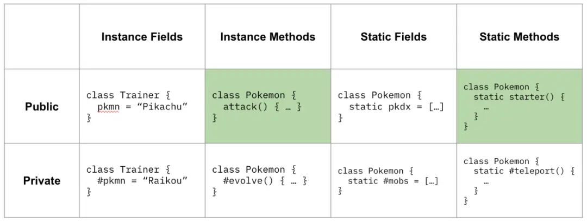

# ES2022

- https://github.com/tc39/proposals/blob/master/finished-proposals.md

- Class Fields
  - Private Fields, Methods 使用#前缀定义类的私有方法和字段
  - Public Static Class Fields 静态公共字段
  - Private Fields In Operator 检测私有字段是否存在。
    - 可以通过 in 关键字来判断
  - Class Static Initialization Blocks 类静态初始化块
- Relative indexing .at() method
  - 在所有内置的可索引数据上新增 `.at()` 方法。
  - 可索引类型（String/Array/TypedArray）可以通过 at 来读取指定索引的元素，而且支持传入负数
- Object.hasOwn
  - 使用 `Object.hasOwn(obj, 'key')` 替代 `Object.prototype.hasOwnProperty.call(obj, 'key')`
- Error Cause 异常链
  - 为 JavaScript 中的 Error 构造函数新增了一个属性 cause, 为抛出的错误附加错误原因
- RegExp Match Indices ('d' Flag) 正则表达式切片
  - 向 RegExp.prototype.exec 返回的数组对象上，新增 indices 属性用来描述这些位置信息
  - 通过正则匹配，我们只能拿到匹配到的字符串，通过切片可以拿到这些字符串在原字符串的位置
- Top-Level Await
  - 允许在 Async functions 之外使用 await

提案为 ECMAScript Class 新增了下表中所描述的特性（绿色为现有特性）



## 异常链

直接看示例，通过 err1.cause 可以拿到 err0 ；如果这个异常被重新抛出了很多次，那通过 err1.cause.cause.... 就能拿到所有相关的异常。

```js
function willThrowError() {
  try {
    // do something
  } catch (err0) {
    throw new Error("one error", { cause: err });
  }
}

try {
  willThrowError();
} catch (err1) {
  // 通过 err1.cause 就能拿到 err0 了
}
```
