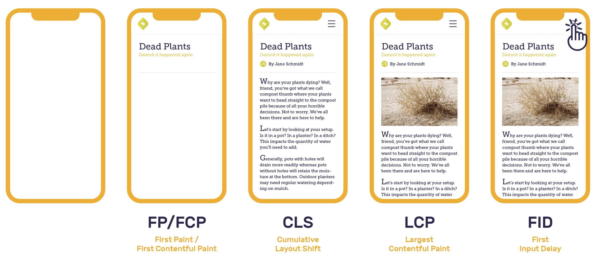

# LCP vs FMP

> 性能监控的底线应该是不让性能变得更糟

其实统计首屏时间本身就是浏览器的职责，交由浏览器来处理是最好的。 目前W3C关于首屏统计已经进入了提议阶段，坐等W3C再次标准化。

- https://github.com/w3c/paint-timing

## Web Vitals

- https://docs.sentry.io/product/performance/web-vitals/
- https://web.dev/vitals/

[Web Vitals](https://web.dev/vitals/)是一组由 Google 定义的指标，用于衡量呈现时间、响应时间和布局偏移。每个数据点都提供有关应用程序整体性能的见解。

- LCP(Largest Contentful Paint)   测量最大内容出现在视口中的渲染时间。
- FID(First Input Delay)          测量用户尝试与视口交互时的响应时间。
- CLS(Cumulative Layout Shift)    是渲染过程中每个意外元素偏移的单个布局偏移分数的总和。



其他网络重要信息，https://web.dev/lighthouse-performance/

- FP(First Paint)             测量第一个像素出现在视口中所花费的时间
- FCP(First Contentful Paint) 测量第一个内容在视口中呈现的时间。
- TTI(Time To Interactive)    交互时间TTI 衡量一个页面需要多长时间才能完全交互
- SI(Speed Index)             速度指数衡量页面加载期间内容的视觉显示速度。
- TBT(Total Blocking Time)    总阻塞时间，测量 FCP 和 TTI 之间主线程被阻塞足够长的时间以防止输入响应的总时间。
- CLS(Cumulative Layout Shift)是衡量页面整个生命周期内发生的每个意外布局偏移的最大布局偏移分数的度量。
- FID(Fist Inout Delay)       x 测量用户尝试与视口交互时的响应时间。
- FMP(First Meaningful Paint) x 首次有意义的绘制，指页面的首要内容（primary content）出现在屏幕上的时间。
  - 参考：https://web.dev/first-meaningful-paint/
  - [首次有意义绘制的时间：基于布局的方法](https://docs.google.com/document/d/1BR94tJdZLsin5poeet0XoTW60M0SjvOJQttKT-JK8HI/view)
- FCI(First CPU Idle)         x

关于这些指标，有发生过定义上的变化，参考

- Lighthouse评分计算器
  - https://web.dev/performance-scoring/
  - [Lighthouse scoring calculator](https://googlechrome.github.io/lighthouse/scorecalc/)

## 关于 LCP

最大内容绘制 (LCP) 指标报告视口内可见的最大图像或文本块的渲染时间，相对于页面首次开始加载的时间。

参考

- https://web.dev/lcp/
- https://wicg.github.io/largest-contentful-paint/

具体细节：

- 将元素限制在这个有限的集合中是有意的，以便在开始时保持简单。
  - 目前包含：img,image,video,包含文本节点或内联文本元素的块级元素
- 元素的大小是如何确定的？
  - 为最大内容绘制报告的元素大小通常是用户在视口内可见的大小。如果元素延伸到视口之外，或者任何元素被剪裁或具有不可见的溢出，则这些部分不计入元素的大小。
- 什么时候报告最大的内容？
  - 网页通常分阶段加载，因此，页面上最大的元素可能会发生变化。

确认点

- 测试示例
- 如果内容来自 ajax 呢

## FMP vs LCP

如果只能用一个指标代表前端页面性能，应该用哪个？

核心内容展示时间

FMP vs LCP

- FMP 侦听页面元素的变化，每次新增节点数量最多的时间点
  - 限制：没有标准实现；对页面细微的变化过于敏感
- LCP 统计图片，视频/直播，文本节点中最大屏幕元素额绘制的时间
  - 限制：最大元素不一定是最重要的元素；浏览器支持率仅 70% （safari 不支持）
  - https://github.com/GoogleChrome/web-vitals#browser-support
  - https://caniuse.com/?search=largest-contentful-paint

不推荐使用第一次有意义的绘制 (FMP)。在实践中，FMP 对页面加载的微小差异过于敏感，导致结果不一致（双峰）。此外，该指标的定义依赖于特定于浏览器的实现细节，这意味着它无法标准化，也无法在所有 Web 浏览器中实现。

```js
function browserSupportsEntry(type) {
  // More extensive feature detect needed for Firefox due to:
  // https://github.com/GoogleChrome/web-vitals/issues/142
  if (type === 'first-input' && !('PerformanceEventTiming' in window)) {
    return false;
  }

  return window.PerformanceObserver &&
      window.PerformanceObserver.supportedEntryTypes &&
      window.PerformanceObserver.supportedEntryTypes.includes(type);
}

async function() {
  browserSupportsLCP = await browserSupportsEntry('largest-contentful-paint');
}
const browserSupportsLCP = browserSupportsEntry('largest-contentful-paint');
// https://caniuse.com/?search=largest-contentful-paint
```

## 关于 FMP

参考

- [FMP技术实现方案](https://zhuanlan.zhihu.com/p/44933789)
- https://w3c.github.io/paint-timing/
- https://help.aliyun.com/document_detail/89010.html
- https://zhuanlan.zhihu.com/p/28249188

最早Google lighthouse提出了FMP的概念, first meaning paint, 也就是主要内容可见时间, 那什么是主要内容？

每个人得出的结论可能会不一样，先做一个猜想：主要内容 = 页面渲染过中元素增量最大的点。

![img/FMP-arms.jpg]

那到底是什么原因导致我们的猜想不成立？

- 首先很容易想到的是元素是否可见，元素如果是不可见的，那就算增加再多，对用户也是无感知的，一定不能认定为主要内容。
- 其次是每个元素对页面的影响是否等效？从手淘的案例来看，占位屏的信息价值明显比不上第三屏的内容。因此，对不同的元素需要有不同的权重来衡量。阿里云前端监控是取元素到根节点的长度作为权重。

根据上面的修正因子。ARMS 重新设计了一遍算法, 如下图所示

![img/FMP-计算方式.jpg]

分为三个步骤

1. 侦听页面元素的变化(MutationObserver 可以观察每批次的元素变动)
2. 遍历**每次新增**的元素，并计算这些元素的得分总和
3. 如果元素可见，得分为 1 * weight(权重), 如果元素不可见，得分为0

如果每次都去遍历新增元素并计算是否可见是非常消耗性能的。实际上采用的是深度优先算法，如果子元素可见，那父元素可见，不再计算。 同样的，如果最后一个元素可见，那前面的兄弟元素也可见。通过深度优先算法，性能有了大幅的提升。

First Meaningful Paint (FMP)

其他

- https://www.jianshu.com/p/456e6eff59c8
- https://blog.csdn.net/qiwoo_weekly/article/details/105985323
- https://www.freesion.com/article/1743400842/
  - https://github.com/GoogleChrome/web-vitals
- https://github.com/bugsnag/bugsnag-js
- https://juejin.cn/post/6994959358064869383

腾讯企鹅辅导 H5 性能极致优化

- https://mp.weixin.qq.com/s/zJMM4SF7pc6LZPCsQfWOxw
- https://mp.weixin.qq.com/s/zJMM4SF7pc6LZPCsQfWOxw
