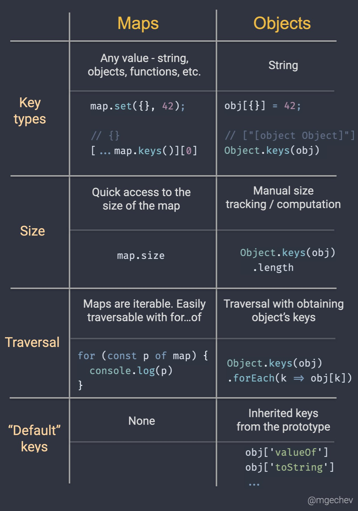

# Map vs Object

区别：

- Key types
- Size
- Traversal
- 'Default' keys

其他

- `Object.entries()`
- `__proto__`
- `Object.create(null)`

参考：

- [Find the difference between maps and objects in JavaScript](https://twitter.com/mgechev/status/1437997120263491590)
