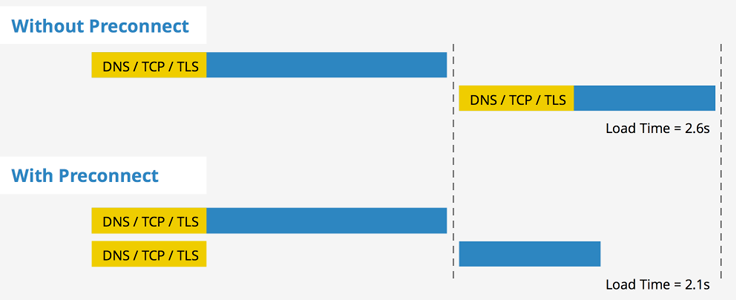

# prefetch vs preload

- prefetch
- preload
- dns-prefetch
- preconnect
- prerender

## prefetch

指定用户代理应预先获取并缓存目标资源，因为后续的导航可能需要它。

关键字 `prefetch` 作为元素 `<link>`  的属性 `rel` 的值，是为了提示浏览器，用户未来的浏览有可能需要加载目标资源，所以浏览器有可能通过事先获取和缓存对应资源，优化用户体验。

从Firefox 44开始，考虑了crossorigin属性的值，从而可以进行匿名预取。

一些问题：

https://developer.mozilla.org/zh-CN/docs/Web/HTTP/Link_prefetching_FAQ

- 什么是链接预取？
- 浏览器的空闲时间是如何确定的？
- 资源正在被预载时点击了某个链接会发生什么？
- 如果后台正在进行下载任务会发生什么？预取会争夺带宽吗？
- 对预取内容是否有限制？
- Mozilla 能够预取不同宿主的文档吗？预取不受同源限制。
- 预提取的请求是否包含Referer: header？
- 作为服务器管理员，我可以区分预取请求和普通请求吗？
- 是否有禁用链接预取的首选项？

## preload

- https://developer.mozilla.org/en-US/docs/Web/HTML/Attributes/rel/preload

关键字 `preload` 作为元素 `<link>` 的属性 `rel` 的值，表示用户十分有可能需要在当前浏览中加载目标资源，所以浏览器必须预先获取和缓存对应资源。

## 不同资源浏览器优先级

在 Chrome 46 以后的版本中，不同的资源在浏览器渲染的不同阶段进行加载的优先级如下图所示：


从图中可以看出：(以 Blink 为例)

- HTML/CSS 资源，其优先级是最高的
- font 字体资源，优先级分别为 Highest/High
- 图片资源，如果出现在视口中，则优先级为 High，否则为 Low

而 script 脚本资源就比较特殊，优先级不一，脚本根据它们在文件中的位置是否异步、延迟或阻塞获得不同的优先级：

- 网络在第一个图片资源之前阻塞的脚本在网络优先级中是 High
- 网络在第一个图片资源之后阻塞的脚本在网络优先级中是 Medium
- 异步/延迟/插入的脚本（无论在什么位置）在网络优先级中是 Low

自己网站资源优先级也可以通过 Chrome 控制台 Network 一栏进行查看.

1. 对于使用 prefetch 获取资源，其优先级默认为最低，Lowest，可以认为当浏览器空闲的时候才会去获取的资源。
2. 而对于 preload 获取资源，可以通过 "as" 或者 "type" 属性来标识他们请求资源的优先级（比如说 preload 使用 as="style" 属性将获得最高的优先级，即使资源不是样式文件)
3. 没有 “as” 属性的将被看作异步请求。

## dns-prefetch

DNS 预解析。预先进行 DNS 查询，在用户浏览页面同时，可解析将要用到的域名。

DNS-prefetch 尝试在请求资源之前解析域名。

```html
<link rel="dns-prefetch" href="//static.xxx.com">
```

最佳实践

1. dns-prefetch 仅对跨源域上的 DNS 查找有效，因此请避免使用它来指向你的站点或域。这是因为，到浏览器看到提示时，你的站点背后的 IP 已经被解析了。
2. 可以通过使用 HTTP Link 字段将 dns-prefetch（以及其他资源提示）指定为 HTTP 标头之一：

    ```HTTP
    Link: <https://fonts.googleapis.com/>; rel=dns-prefetch
    ```

3. 考虑将 dns-prefetch 与 preconnect 提示配对。dns-prefetch 只执行 DNS 查询，而 preconnect 则是建立与服务器的连接。这个过程包括 DNS 解析，以及建立 TCP 连接，如果是 HTTPS 网站，就进一步执行 TLS 握手。将这两者结合起来，可以进一步减少跨源请求的感知延迟。你可以像这样安全地将它们结合起来使用：

    ```html
    <link rel="preconnect" href="https://fonts.googleapis.com/" crossorigin />
    <link rel="dns-prefetch" href="https://fonts.googleapis.com/" />
    ```

> 备注： 如果页面需要建立与许多第三方域的连接，则将它们预先连接会适得其反。`preconnect` 提示最好仅用于最关键的连接。对于其他的连接，只需使用 `<link rel="dns-prefetch">` 即可节省第一步——DNS 查询——的时间。
>
> crossorigin 属性必须，不然资源会加载两次

数据验证:

1. 删除本地 DNS 缓存

```bash
# windows
# ipconfig /displaydns: 查看DNS缓存
# ipconfig /flushdns: 清空DNS缓存

# mac
# https://support.apple.com/en-us/HT202516
# https://www.freecodecamp.org/chinese/news/how-to-flush-dns-on-mac-macos-clear-dns-cache/
# https://sysin.org/blog/how-to-flush-dns-cache/

# 重置 DNS 缓存，适用于 macOS 10.15 至 14.x:
sudo killall -HUP mDNSResponder; sudo dscacheutil -flushcache
```

2. 重启浏览器

```html
<!DOCTYPE html>
<html lang="en">
<head>
  <meta charset="UTF-8">
  <meta name="viewport" content="width=device-width, initial-scale=1.0">
  <title>Document</title>
  <link rel="preconnect" href="https://pss.bdstatic.com/" crossorigin />
  <link rel="dns-prefetch" href="https://pss.bdstatic.com/" />
</head>
<body>
  preconnect vs dns-prefetch

  <!-- https://pss.bdstatic.com/static/superman/js/lib/jquery-1-edb203c114.10.2.js -->
</body>
</html>
```

使用 Wireshark

```conf
dns.qry.name contains bdstatic.com || ip.dst === 47.93.222.203

; 过滤器
dst host pss.bdstatic.com || src port 53
```

参考：

- https://zhuanlan.zhihu.com/p/358836730
- https://tech.youzan.com/dns-prefetching/
- https://www.chromium.org/developers/design-documents/dns-prefetching/
  - Manual Prefetch


## preconnect

指定用户代理应预先连接到目标资源的来源。

预先建立 HTTP 连接。包括 DNS 查询、TCP 握手链接建立以及 TLS 连接。



## prerender

指定用户代理应预先获取目标资源，并以有助于在未来提供更快的响应的方式处理它。

## modulepreload

更早和更高优先级的加载模块脚本


参考：

- **推荐** [使用 Preload/Prefetch 优化你的应用](https://zhuanlan.zhihu.com/p/48521680)
- [HTTP/2 PUSH(推送)与HTTP Preload(预加载)大比拼](http://ddrv.cn/a/17872)
  - 原文地址 https://github.com/happylindz/blog/issues/17
- https://developer.mozilla.org/zh-CN/docs/Web/HTML/Link_types
- https://developer.mozilla.org/zh-CN/docs/Web/HTTP/Link_prefetching_FAQ
- https://html.spec.whatwg.org/#link-type-prefetch

