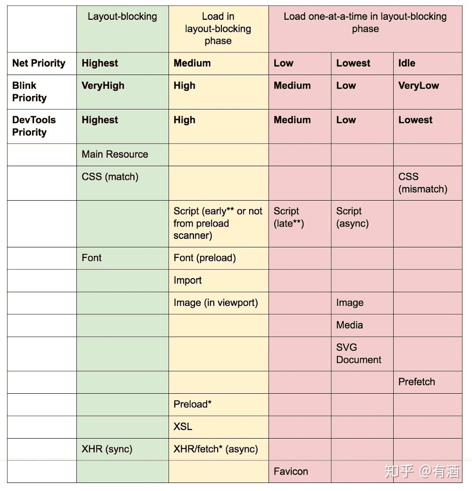

# prefetch vs preload

- prefetch
- preload
- dns-prefetch
- preconnect
- prerender

## prefetch

关键字 `prefetch` 作为元素 `<link>`  的属性 `rel` 的值，是为了提示浏览器，用户未来的浏览有可能需要加载目标资源，所以浏览器有可能通过事先获取和缓存对应资源，优化用户体验。

从Firefox 44开始，考虑了crossorigin属性的值，从而可以进行匿名预取。

一些问题：

https://developer.mozilla.org/zh-CN/docs/Web/HTTP/Link_prefetching_FAQ

- 什么是链接预取？
- 浏览器的空闲时间是如何确定的？
- 资源正在被预载时点击了某个链接会发生什么？
- 如果后台正在进行下载任务会发生什么？预取会争夺带宽吗？
- 对预取内容是否有限制？
- Mozilla 能够预取不同宿主的文档吗？预取不受同源限制。
- 预提取的请求是否包含Referer: header？
- 作为服务器管理员，我可以区分预取请求和普通请求吗？
- 是否有禁用链接预取的首选项？

## preload

https://developer.mozilla.org/zh-CN/docs/Web/HTML/Preloading_content

关键字 `preload` 作为元素 `<link>` 的属性 `rel` 的值，表示用户十分有可能需要在当前浏览中加载目标资源，所以浏览器必须预先获取和缓存对应资源。

## 不同资源浏览器优先级

在 Chrome 46 以后的版本中，不同的资源在浏览器渲染的不同阶段进行加载的优先级如下图所示：

从图中可以看出：(以 Blink 为例)

- HTML/CSS 资源，其优先级是最高的
- font 字体资源，优先级分别为 Highest/High
- 图片资源，如果出现在视口中，则优先级为 High，否则为 Low

而 script 脚本资源就比较特殊，优先级不一，脚本根据它们在文件中的位置是否异步、延迟或阻塞获得不同的优先级：

- 网络在第一个图片资源之前阻塞的脚本在网络优先级中是 High
- 网络在第一个图片资源之后阻塞的脚本在网络优先级中是 Medium
- 异步/延迟/插入的脚本（无论在什么位置）在网络优先级中是 Low

自己网站资源优先级也可以通过 Chrome 控制台 Network 一栏进行查看.

1. 对于使用 prefetch 获取资源，其优先级默认为最低，Lowest，可以认为当浏览器空闲的时候才会去获取的资源。
2. 而对于 preload 获取资源，可以通过 "as" 或者 "type" 属性来标识他们请求资源的优先级（比如说 preload 使用 as="style" 属性将获得最高的优先级，即使资源不是样式文件)
3. 没有 “as” 属性的将被看作异步请求。

## dns-prefetch

提示浏览器该资源需要在用户点击链接之前进行DNS查询和协议握手

## preconnect

向浏览器提供提示，建议浏览器提前打开与链接网站的连接，而不会泄露任何私人信息或下载任何内容，以便在跟随链接时可以更快地获取链接内容。

## modulepreload

更早和更高优先级的加载模块脚本

参考：

- **推荐** [使用 Preload/Prefetch 优化你的应用](https://zhuanlan.zhihu.com/p/48521680)
- [HTTP/2 PUSH(推送)与HTTP Preload(预加载)大比拼](http://ddrv.cn/a/17872)
  - 原文地址 https://github.com/happylindz/blog/issues/17
- https://developer.mozilla.org/zh-CN/docs/Web/HTML/Link_types
- https://developer.mozilla.org/zh-CN/docs/Web/HTTP/Link_prefetching_FAQ
- https://html.spec.whatwg.org/#link-type-prefetch

