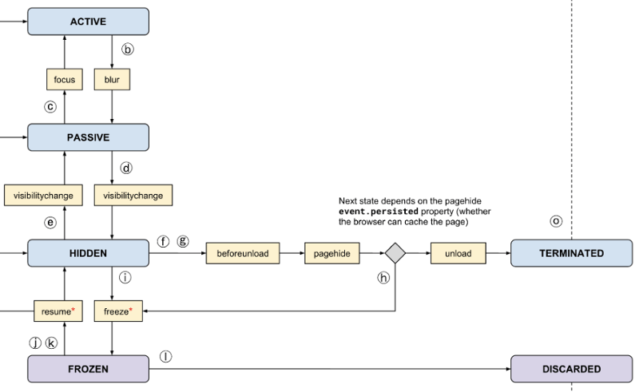

# Page Lifecycle API

Page Visibility API。可以监听各种情况的网页卸载。

但是，它没有解决一个问题。Android、iOS 和最新的 Windows 系统可以随时自主地停止后台进程，及时释放系统资源。也就是说，网页可能随时被系统丢弃掉。Page Visibility API 只在网页对用户不可见时触发，至于网页会不会被系统丢弃掉，它就无能为力了。

为了解决这个问题，W3C 新制定了一个 [Page Lifecycle API](https://github.com/WICG/page-lifecycle)，统一了网页从诞生到卸载的行为模式，并且定义了新的事件，允许开发者响应网页状态的各种转换。

有了这个 API，开发者就可以预测网页下一步的状态，从而进行各种针对性的处理。Chrome 68 支持这个 API，对于老式浏览器可以使用谷歌开发的兼容库 [PageLifecycle.js](https://github.com/GoogleChromeLabs/page-lifecycle)。

网页的生命周期分成六个阶段，每个时刻只可能处于其中一个阶段。

## 问题

当状态变化时，页面的 js 逻辑会如何？

参考：

- http://www.ruanyifeng.com/blog/2018/11/page_lifecycle_api.html
- https://github.com/GoogleChromeLabs/page-lifecycle
