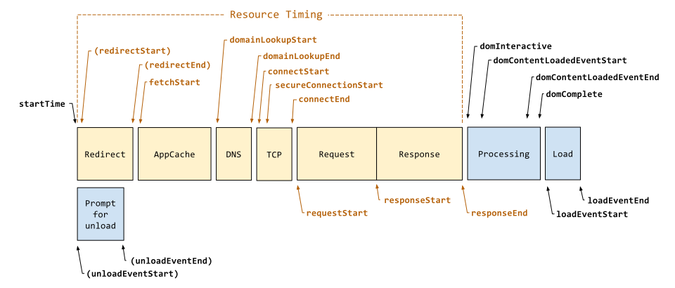

# Performance API

Performance API 定义了 DOMHighResTimeStamp 类型，而不是使用 Date.now()接口。

- [Performance API](https://developer.mozilla.org/zh-CN/docs/Web/API/Performance_API)
- [网页性能管理详解](http://www.ruanyifeng.com/blog/2015/09/web-page-performance-in-depth.html)
- [Performance Timeline](https://developer.mozilla.org/zh-CN/docs/Web/API/Performance_Timeline)
- [初探 performance – 监控网页与程序性能](http://www.alloyteam.com/2015/09/explore-performance/)
- [使用性能API快速分析web前端性能](https://segmentfault.com/a/1190000004010453)
- w3c navigation-timing
  - https://w3c.github.io/navigation-timing 👍
  - https://www.w3.org/TR/navigation-timing
- [性能优化篇 - Performance（工具 & api）](https://juejin.cn/post/6844903801518981133)
- [Performance — 前端性能监控利器](https://www.cnblogs.com/bldxh/p/6857324.html)
- [Chrome的Performance面板](https://www.jianshu.com/p/d476bd527e48)
- https://web.dev/lab-and-field-data-differences/#field-data
- https://developers.google.com/speed/pagespeed/insights/
- https://web.dev/navigation-and-resource-timing/
- https://web.dev/chrome-ux-report-data-studio-dashboard/
- 数据洞察 https://datastudio.google.com/navigation/reporting

时序图



```js
// window.performance
{
  eventCounts: {size: 36},
  // memory 是非标准属性，只在 Chrome 有
  memory: {
    jsHeapSizeLimit: 4294705152,  // 内存大小限制
    totalJSHeapSize: 8757487,     // 可使用的内存
    usedJSHeapSize: 7985291,      // JS 对象（包括V8引擎内部对象）占用的内存，一定小于 totalJSHeapSize
  },
  navigation: {
    redirectCount: 0, // 如果有重定向的话，页面通过几次重定向跳转而来
    type: 0,          // 0   即 TYPE_NAVIGATENEXT 正常进入的页面（非刷新、非重定向等）
                      // 1   即 TYPE_RELOAD       通过 window.location.reload() 刷新的页面
                      // 2   即 TYPE_BACK_FORWARD 通过浏览器的前进后退按钮进入的页面（历史记录）
                      // 255 即 TYPE_UNDEFINED    非以上方式进入的页面
  },
  timeOrigin: 1629105163391.1,
  timing: {
    // 时间节点及指标计算

    // Resource Timing
    // 在同一个浏览器上下文中，前一个网页（与当前页面不一定同域）unload 的时间戳，如果无前一个网页 unload ，则与 fetchStart 值相等
    navigationStart: 1629105163391,
    // Prompt for unload
    // 前一个网页（与当前页面同域）unload 的时间戳，如果无前一个网页 unload 或者前一个网页与当前页面不同域，则值为 0
    unloadEventStart: 0,
    // 和 unloadEventStart 相对应，返回前一个网页 unload 事件绑定的回调函数执行完毕的时间戳
    unloadEventEnd: 0,
    // Redirect
    // 第一个 HTTP 重定向发生时的时间。有跳转且是同源的重定向才算，否则值为 0
    redirectStart: 0,
    // 最后一个 HTTP 重定向完成时的时间。有跳转且是同源的重定向才算，否则值为 0
    redirectEnd: 0,
    // AppCache
    // 浏览器准备好使用 HTTP 请求抓取文档的时间，这发生在检查本地缓存之前
    fetchStart: 1629105163394,
    // DNS
    // DNS 域名查询开始的时间，如果使用了本地缓存（即无 DNS 查询）或持久连接，则与 fetchStart 值相等
    domainLookupStart: 1629105163394,
    // DNS 域名查询完成的时间，如果使用了本地缓存（即无 DNS 查询）或持久连接，则与 fetchStart 值相等
    domainLookupEnd: 1629105163394,
    // TCP
    // HTTP（TCP） 开始建立连接的时间，如果是持久连接，则与 fetchStart 值相等
    // 注意如果在传输层发生了错误且重新建立连接，则这里显示的是新建立的连接开始的时间
    connectStart: 1629105163394,
      // HTTPS
      // HTTPS 连接开始的时间，如果不是安全连接，则值为 0
      secureConnectionStart: 0,
    // HTTP（TCP） 完成建立连接的时间（完成握手），如果是持久连接，则与 fetchStart 值相等
    // 注意如果在传输层发生了错误且重新建立连接，则这里显示的是新建立的连接完成的时间
    // 注意这里握手结束，包括安全连接建立完成、SOCKS 授权通过
    connectEnd: 1629105163394,
    // Request
    // HTTP 请求读取真实文档开始的时间（完成建立连接），包括从本地读取缓存
    // 连接错误重连时，这里显示的也是新建立连接的时间
    requestStart: 1629105163452,
    // Response
    // HTTP 开始接收响应的时间（获取到第一个字节），包括从本地读取缓存
    responseStart: 1629105163453,
    // HTTP 响应全部接收完成的时间（获取到最后一个字节），包括从本地读取缓存
    responseEnd: 1629105163455,

    // Processing
    // 开始解析渲染 DOM 树的时间，此时 Document.readyState 变为 loading，并将抛出 readystatechange 相关事件
    // ⚠️ 因 domLoading 特定于实现，不应在有意义的指标中使用，参见 w3c
    domLoading: 1629105163505,
    domInteractive: 1629105163595,
    // 完成解析 DOM 树的时间，Document.readyState 变为 interactive，并将抛出 readystatechange 相关事件
    // 注意只是 DOM 树解析完成，这时候并没有开始加载网页内的资源
    domContentLoadedEventStart: 1629105163852,
    // DOM 解析完成后，网页内资源加载开始的时间
    // 在 DOMContentLoaded 事件抛出前发生
    // DOM 解析完成后，网页内资源加载完成的时间（如 JS 脚本也加载执行完毕），文档的DOMContentLoaded 事件的结束时间
    domContentLoadedEventEnd: 1629105163852,
    // DOM 树解析完成，且资源也准备就绪的时间，Document.readyState 变为 complete，并将抛出 readystatechange 相关事件
    domComplete: 1629105163897,

    // Load
    // load 事件发送给文档，也即 load 回调函数开始执行的时间
    // 注意如果没有绑定 load 事件，以下两个值都为 0
    loadEventStart: 1629105163897,
    // load 事件的回调函数执行完毕的时间
    loadEventEnd: 1629105163897,

    // 白屏时间: responseStart - navigationStart
  },
}
```

## 关于 PerformanceResourceTiming

参见

- [PerformanceResourceTiming](https://developer.mozilla.org/zh-CN/docs/Web/API/PerformanceResourceTiming)
  - https://developer.mozilla.org/zh-CN/docs/Web/API/Resource_Timing_API/Using_the_Resource_Timing_API
- [w3c resource-timing](https://w3c.github.io/resource-timing/)
- [PerformanceEntry.entryType](https://developer.mozilla.org/en-US/docs/Web/API/PerformanceEntry/entryType)
- https://www.mifengjc.com/api/PerformanceResourceTiming.html
- https://developers.google.com/web/fundamentals/performance/navigation-and-resource-timing
  - https://siusin.github.io/perf-timing-primer/
  - https://github.com/andydavies/waterfall
  - https://github.com/micmro/performance-bookmarklet
- https://web.dev/custom-metrics/?utm_source=devtools#server-timing-api
- https://nicj.net/resourcetiming-in-practice/
  - 资源加载时间数据上报压缩
    - https://nicj.net/compressing-resourcetiming/
    - https://github.com/nicjansma/resourcetiming-compression.js
    - https://github.com/akamai/boomerang/tree/master/plugins
- https://github.com/akamai/boomerang
  - https://nicj.net/side-effects-of-boomerangs-javascript-error-tracking/

### PerformanceEntry.entryType

参看 [entryType 注册表](https://w3c.github.io/timing-entrytypes-registry/#registry) availableFromTimeline

- frame
- navigation
- resource
- paint
- mark
- measure
- element  非w3c规范
- longtask 草案尚不可用，具体用法参见 [longtasks-api](https://w3c.github.io/longtasks/)

### initiatorType 的值：(谁发起的请求)


发起对象 | 值 | 描述
--- | --- | ----
a Element | link/script/img/iframe等 | 通过标签形式加载的资源，值是该节点名的小写形式
a CSS resource | css | 通过css样式加载的资源，比如background的url方式加载资源
a XMLHttpRequest object | xmlhttprequest/fetch | 通过xhr加载的资源
a PerformanceNavigationTiming object | navigation | 当对象是PerformanceNavigationTiming时返回

> 目前通过`<audio>`，`<video>`加载资源,`initiatorType`还无法返回"audio"和"video"，chrome中只能返回空字符串,firfox返回"other"
> 如果一个图片在页面内既用img引入，又作为背景图片引入，那么`initiatorType`返回的"img"
> 使用该方法统计资源信息的时候首先可以合理利用`clearResourceTimings()`清除已统计过的对象避免重复统计，其次要过滤掉因上报统计数据而产生的对象。


```js
{
  connectEnd: 320.1000000014901,
  connectStart: 187.39999999850988,
  decodedBodySize: 145205,
  domainLookupEnd: 182,
  domainLookupStart: 182,
  duration: 196.5, // 加载时间
  encodedBodySize: 36059,
  entryType: 'resource', // 资源类型
  fetchStart: 182,
  initiatorType: 'link', // 谁发起的请求
  name: 'https://xxx.com/1.0.0/static/css/first-screen.chunk.css', // 资源名称，是资源的绝对路径或调用mark方法自定义的名称
  nextHopProtocol: 'h2', // http/1.1
  redirectEnd: 0,
  redirectStart: 0,
  requestStart: 321,
  responseEnd: 378.5,
  responseStart: 354.19999999925494,
  secureConnectionStart: 187.89999999850988,
  serverTiming: [],
  startTime: 182,     // 开始时间
  transferSize: 36359,
  workerStart: 0,
}
```

其他：

- [使用 puppeteer 测试性能](https://github.com/pod4g/hiper.git)
